# Fabric-Focus

Fabric-Focus is a full-stack Django e-commerce project created as an assessment submission. It delivers a complete online shopping flow for a contemporary clothing store, from product discovery through to bag management, Stripe checkout, account handling, order history, superuser product management, and an AI-powered style assistant.

The project aims to demonstrate:

- full-stack Django development across multiple apps
- secure account and checkout flows
- responsive front-end design across standard Bootstrap breakpoints
- CRUD functionality for store administration
- documented testing, validation, and deployment evidence suitable for assessment review

## Live Demo

- Hosted on Heroku: https://fabric-focus-f1a8e9ed6562.herokuapp.com/
- GitHub repository: https://github.com/Matt-Wilshaw/fabric-focus

## Table of Contents

- [Fabric-Focus](#fabric-focus)
  - [Live Demo](#live-demo)
  - [Table of Contents](#table-of-contents)
  - [Project Goals](#project-goals)
  - [Technologies Used](#technologies-used)
  - [Strategy (Why?)](#strategy-why)
  - [Scope (What?)](#scope-what)
    - [Functional Requirements](#functional-requirements)
    - [Content Requirements](#content-requirements)
  - [Structure (How is it organised?)](#structure-how-is-it-organised)
    - [Information Architecture](#information-architecture)
    - [Skeleton (Layout and Interaction)](#skeleton-layout-and-interaction)
    - [Surface (Visual Design)](#surface-visual-design)
  - [Features](#features)
  - [Admin Access](#admin-access)
  - [Design Choices](#design-choices)
  - [Wireframes](#wireframes)
    - [Colour Palette](#colour-palette)
    - [Typography](#typography)
    - [Accessibility](#accessibility)
  - [Testing Overview](#testing-overview)
    - [Deployed Test Environment](#deployed-test-environment)
    - [Smoke Test (Production)](#smoke-test-production)
  - [Development Checklist](#development-checklist)
  - [Database Structure](#database-structure)
  - [User Stories](#user-stories)
  - [Installation / Setup](#installation--setup)
    - [1. Clone the Repository](#1-clone-the-repository)
    - [2. Create a Virtual Environment (Optional but Recommended)](#2-create-a-virtual-environment-optional-but-recommended)
    - [3. Install Dependencies](#3-install-dependencies)
    - [4. Configure Local Environment Variables](#4-configure-local-environment-variables)
    - [5. Apply Database Migrations](#5-apply-database-migrations)
    - [6. Create a Superuser (Optional, for Admin Access)](#6-create-a-superuser-optional-for-admin-access)
    - [7. Run the Development Server](#7-run-the-development-server)
    - [8. Run Automated Tests](#8-run-automated-tests)
  - [AI Style Assistant (What to Wear)](#ai-style-assistant-what-to-wear)
    - [Stripe Testing (Stripe CLI - Windows)](#stripe-testing-stripe-cli---windows)
    - [Frontend](#frontend)
  - [Key Outline](#key-outline)
  - [Known Limitations at Submission](#known-limitations-at-submission)
  - [Future Enhancements](#future-enhancements)
  - [Fabric-Focus Deployment Guide](#fabric-focus-deployment-guide)
    - [Prerequisites](#prerequisites)
    - [Steps](#steps)
    - [Tips](#tips)
  - [Author](#author)
  - [Credits](#credits)

## Project Goals

This submission was built to evidence the core requirements of a full-stack commerce project. The primary goals are to:

- provide an end-to-end customer journey from browsing to checkout
- demonstrate Django model, view, template, and form handling across a multi-app project
- integrate Stripe securely for card payments and webhook handling
- support authenticated user features such as registration, login, profile updates, and order history
- provide superuser product management for catalogue maintenance
- document testing, validation, responsive design, and deployment clearly enough for assessment review


## Technologies Used

This project uses the following technologies:

- Language and framework: Python 3.12, Django 4.2.30
- Frontend stack: HTML5, CSS3, JavaScript, Bootstrap 4.4.1 (CDN), jQuery 3.5.1, Font Awesome 5.15.4
- Databases: SQLite (local default) and PostgreSQL via `DATABASE_URL` in production
- Authentication and accounts: django-allauth
- Forms and UI helpers: django-crispy-forms
- Country fields and validation: django-countries
- Media and static handling: Pillow, WhiteNoise, django-storages, boto3 (AWS S3 when `USE_AWS` is enabled)
- Payments: Stripe (Stripe.js on frontend, stripe Python SDK on backend, webhook integration)
- AI integration: Google Gemini API (google-generativeai via the style assistant endpoint)
- HTTP client usage: requests (server-side call to Gemini API)
- Deployment and runtime: Heroku, gunicorn, dj-database-url
- Dependency management: pip with requirements.txt


## Strategy (Why?)
The goal of Fabric-Focus is to provide users with a convenient and engaging online platform for shopping everyday clothing. The current implementation focuses on secure account access, product discovery, bag management, and checkout.

From a business perspective, Fabric-Focus aims to build brand credibility and encourage repeat purchases.

---

## Scope (What?)

### Functional Requirements
The scope plane defines the functional and content requirements of the Fabric-Focus website.

**Functional requirements currently implemented include:**
- User registration and login system  
- Secure user accounts  
- Browsing products by category  
- Viewing individual product pages  
- Adding items to a shopping cart  
- Checkout functionality  

**Planned/future requirements include:**
- Leaving product reviews and ratings  
- Commenting on products or reviews (authenticated users only)  

### Content Requirements
- Product descriptions focusing on fabric quality, fit, and versatility  
- Brand and company information  
- Clear feedback messages (e.g. login errors, successful submissions)  

---

## Structure (How is it organised?)
The structure plane focuses on how information is organised and how users move through the website.

Fabric-Focus follows a standard e-commerce structure:
- Home -> Categories -> Product Page  
- Product Page -> Bag -> Checkout  
- Login/Register -> User Account  

### Information Architecture

- Home
- Products listing
- Product detail
- Bag
- Checkout
- Profile
- Admin panel

---

### Skeleton (Layout and Interaction)
The skeleton plane addresses layout, interface design, and interaction elements.

- Navigation and account access are placed consistently across all pages  
- Product pages prioritise images, pricing, size selection, and "Add to Cart" buttons  
- Error and success messages guide users through interactions  

This layout reduces confusion and improves usability.

---

### Surface (Visual Design)
The surface plane focuses on the visual design and overall aesthetic of Fabric-Focus.

The interface uses:
- A modern, versatile colour palette  
- Clean typography for readability  
- Visual hierarchy to highlight key actions  
- Consistent styling across product listings and forms  

The design supports both usability and brand identity, creating a professional and engaging experience suitable for an academic project.

## Features

- User registration, login, and password reset
- Product browsing, search, sorting, and category filtering
- Product detail pages with imagery, pricing, descriptions, and size options where applicable
- Bag add/update/remove functionality
- Stripe checkout and webhook-driven order confirmation
- Profile management with saved delivery defaults and order history
- Admin product and category management
- Responsive layout across mobile, tablet, and desktop

## Admin Access

If you are logged in as an admin user, you can access the Django admin panel to manage products, categories, users, and orders using:

- https://fabric-focus-f1a8e9ed6562.herokuapp.com/admin/
- `/admin/` (for example, `http://localhost:8000/admin`) for local development

Alternatively, you can go to Product Management from the My Account screen if you want to add a product to the system without using the Django backend.

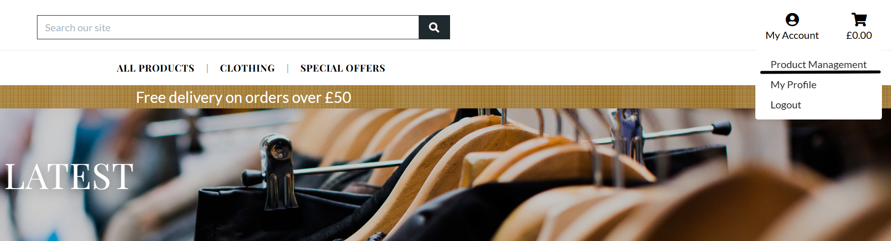

## Design Choices

Design decisions were guided by the goal of making the site feel clean, modern, and easy to use across all standard Bootstrap breakpoints. The interface uses a restrained palette, consistent button styling, and familiar e-commerce patterns so that product browsing and checkout remain straightforward on both desktop and mobile devices.

## Wireframes

Wireframes and screen references were used to guide responsive layout decisions.

**Desktop Homepage**
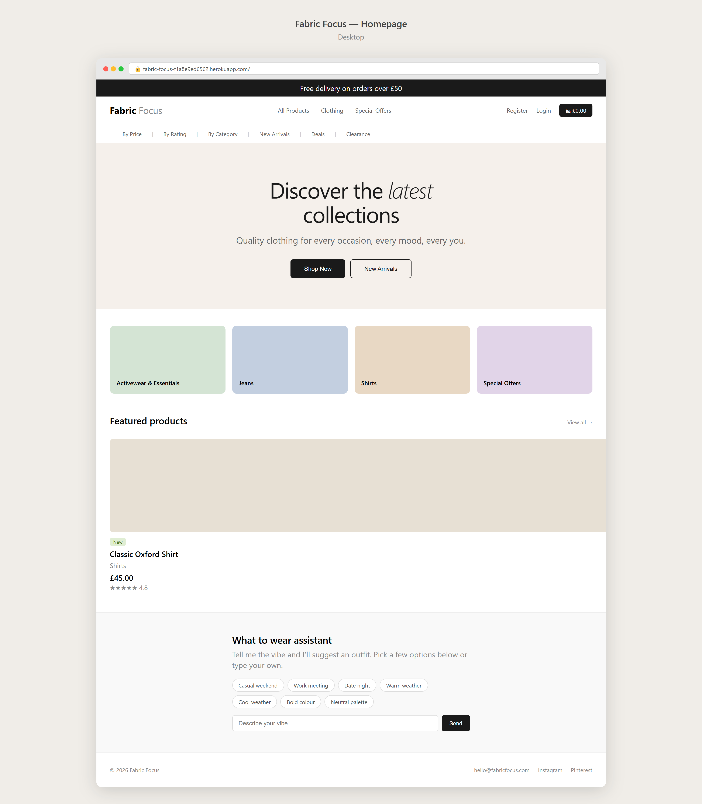

**Desktop Product Detail**
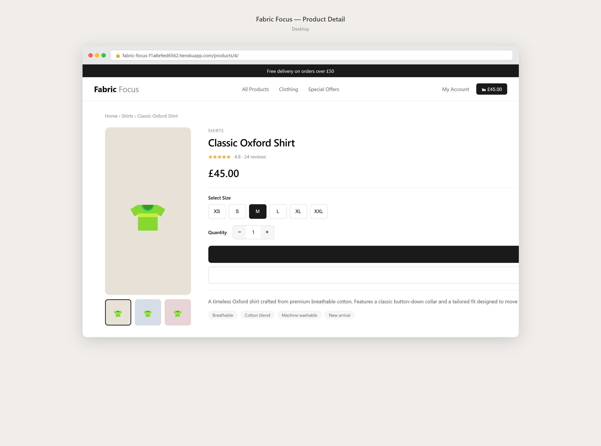

**Desktop Checkout**
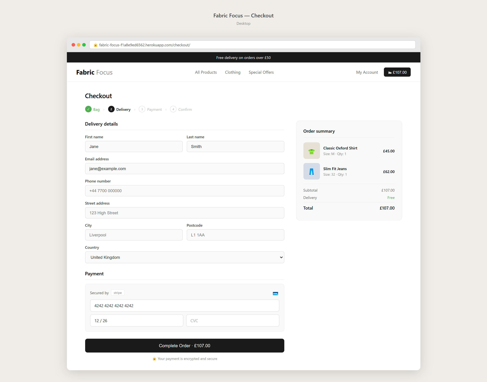

**Desktop Register**
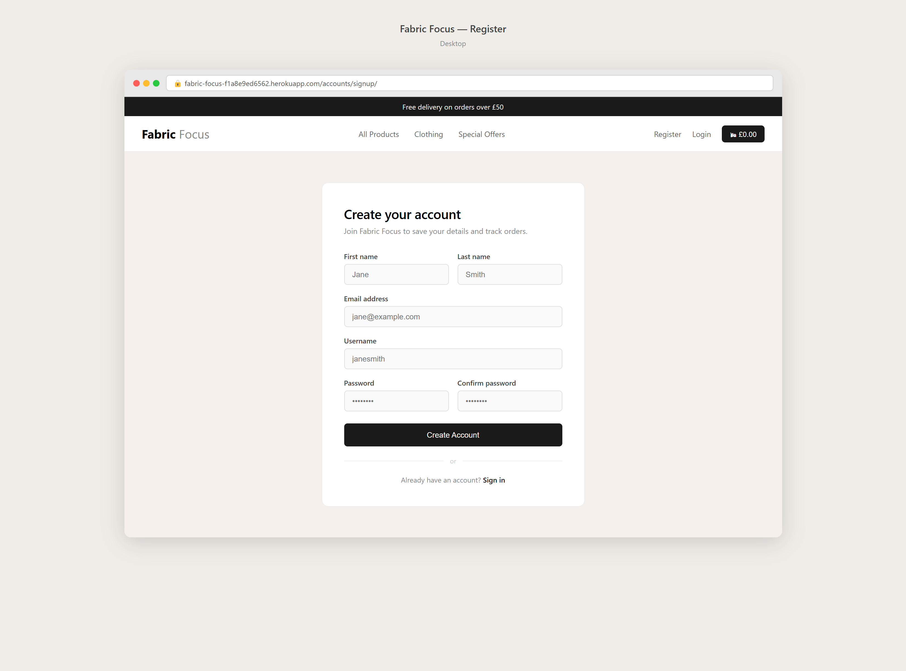

**Desktop Product Management**
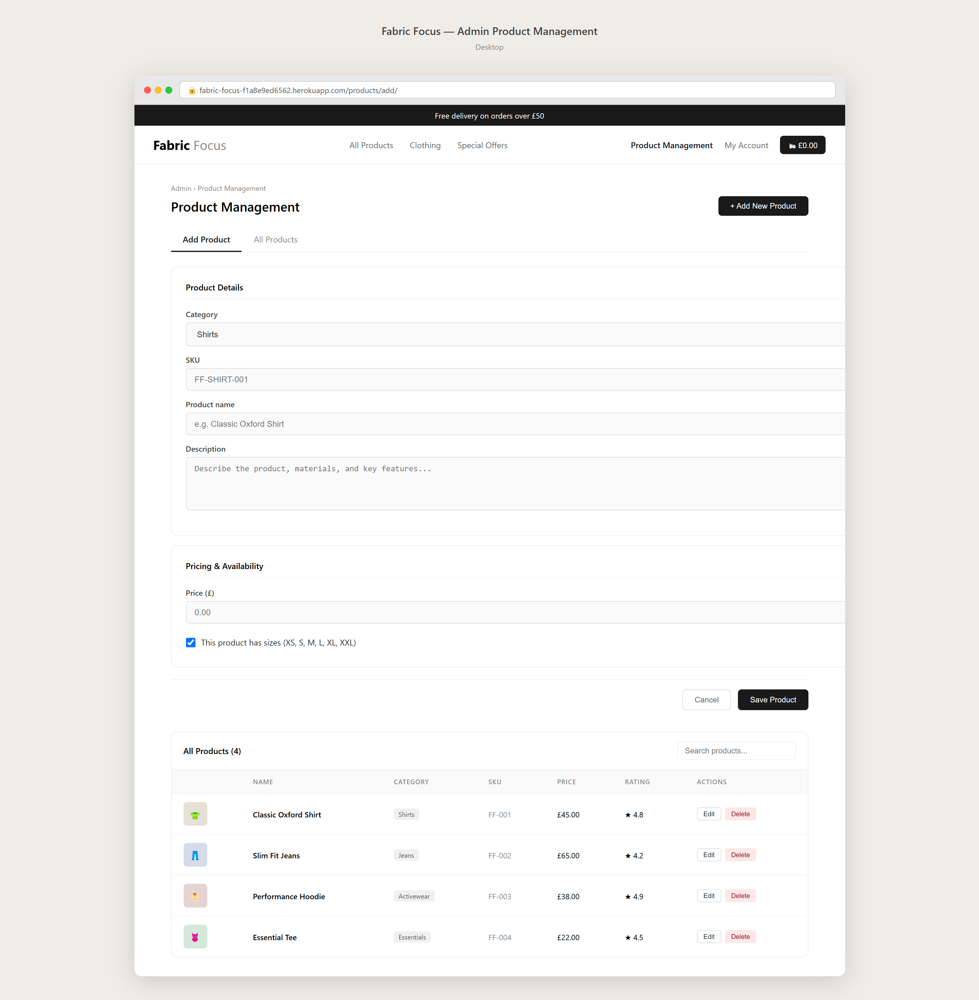

**Mobile and Tablet Homepage**
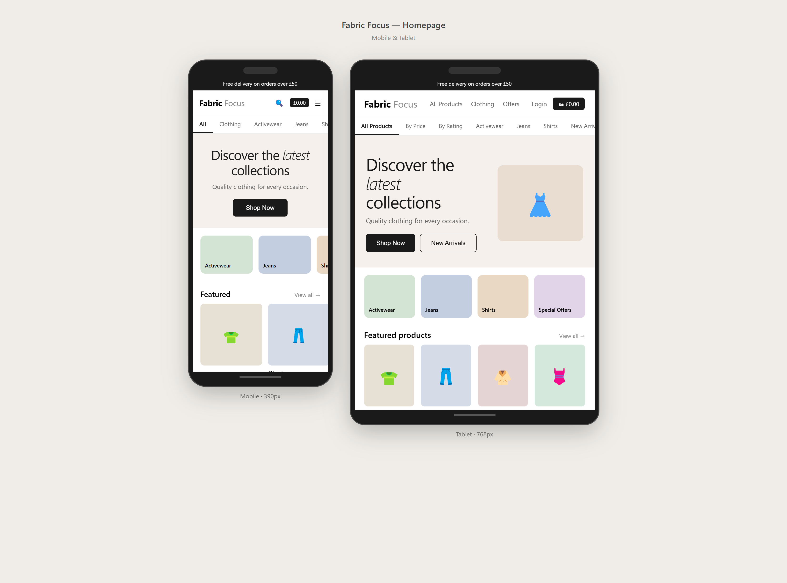

**Mobile and Tablet Product Detail**
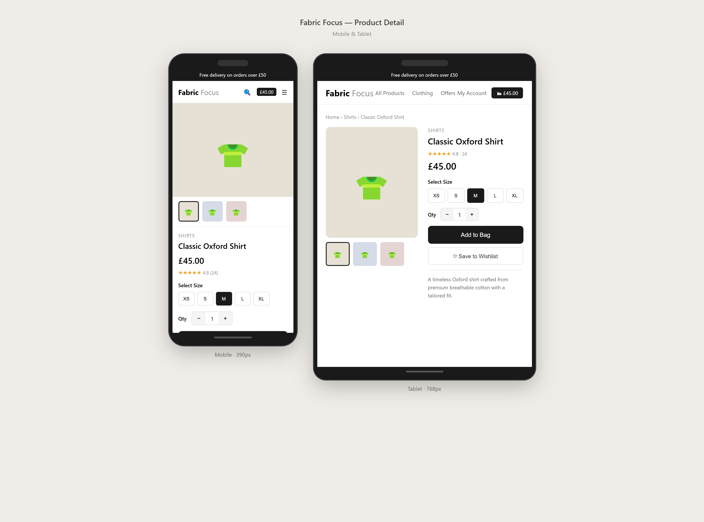

**Mobile and Tablet Checkout**
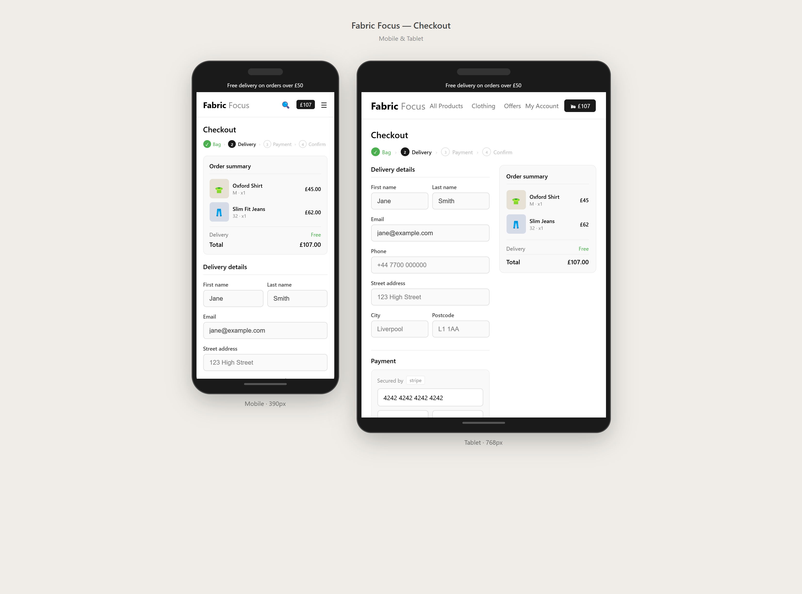

**Mobile and Tablet Register**
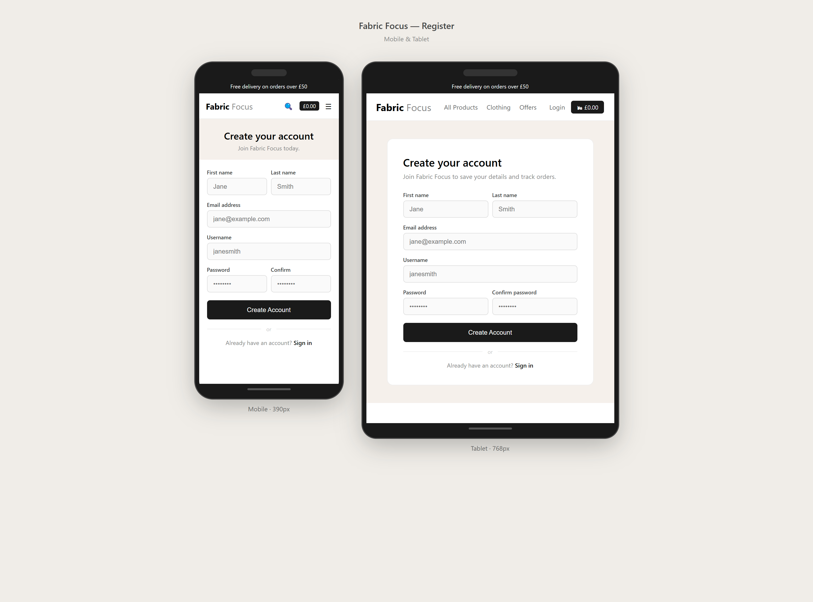

**Mobile and Tablet Product Management**
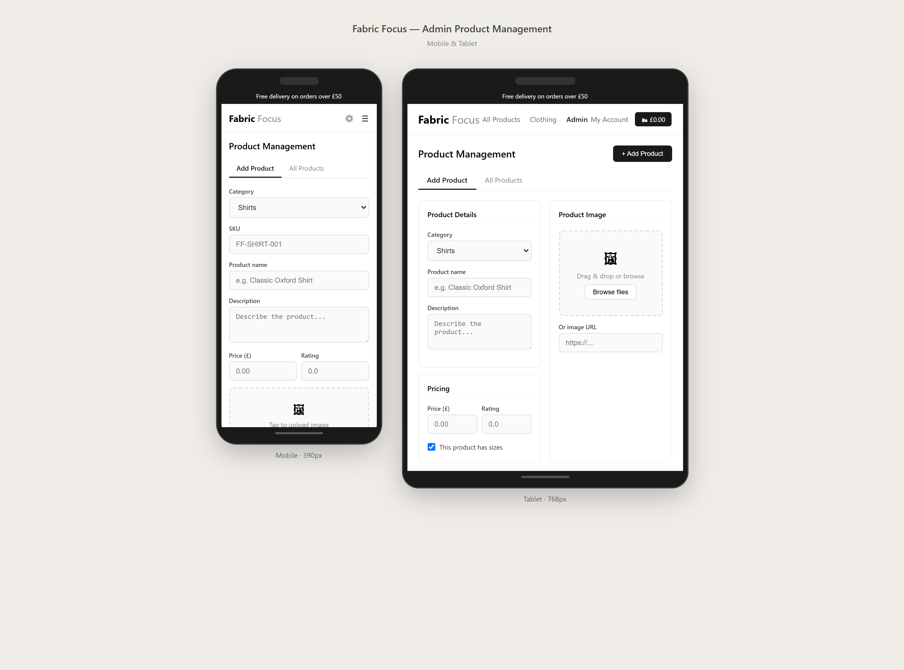

### Colour Palette

Fabric-Focus uses a dark neutral base with warm gold accents.

| Swatch                                                   | Name              | Hex       | Usage                                         |
| -------------------------------------------------------- | ----------------- | --------- | --------------------------------------------- |
|  | Brand Dark        | `#1f2a2e` | Primary UI elements, headings, and navigation |
|  | Brand Dark Hover  | `#162024` | Hover state for dark interactive components   |
|  | Gold Accent       | `#d9a441` | Main call-to-action buttons and highlights    |
|  | Gold Accent Hover | `#c28c2e` | Accent hover states and border variants       |
|  | Body Text Neutral | `#555555` | Default readable body content                 |

These values are defined as CSS variables in `static/css/base.css` and applied consistently across all templates.

### Typography

- **Display Font:** Playfair Display (used for branded headings)
- **Body Font:** Lato (used for readable body copy)

This pairing keeps the store visually premium while preserving readability.

### Accessibility

Accessibility work in this project is documented transparently as a practical review rather than a formal conformance certification.

Confirmed checks:

- Responsive layouts were checked across standard Bootstrap breakpoints.
- Shared template markup was cleaned up and revalidated after validator findings.
- Core form-driven journeys include visible labels, feedback messages, and keyboard-reachable controls.
- Lighthouse accessibility checks were captured for key pages and documented in [TESTING.md](./TESTING.md).

Partially audited:

- Keyboard navigation was manually reviewed on core shopping/account flows.
- Contrast was reviewed in practical testing, with one known homepage CTA contrast issue still tracked.

Not yet fully audited:

- A full WCAG 2.1/2.2 AA audit across every page/state has not been completed.
- A full screen-reader matrix (for example NVDA/JAWS/VoiceOver across all journeys) has not been completed.

See [TESTING.md](./TESTING.md) for dated evidence and the current accessibility status.

## Testing Overview

Testing focuses on end-to-end shopping flows, account access, checkout reliability, and responsive behaviour.

Recent regression work also hardened order authorisation. Order confirmation pages are now restricted to the same checkout session or the rightful account owner, and saved order-history pages require both login and ownership checks.

For complete testing evidence and validation results, see [TESTING.md](./TESTING.md).

### Deployed Test Environment

Production (Heroku) app: https://fabric-focus-f1a8e9ed6562.herokuapp.com/

Use this environment for end-to-end checks (account flow, browsing, bag, checkout, and order confirmation). If the dyno is idle, the first request may take a few seconds.

### Smoke Test (Production)

Run these quick checks after deployment:

1. Home page renders correctly (hero, nav, categories).
2. Product listing loads with image, name, and price.
3. Add an item to bag and confirm totals update.
4. Checkout page loads delivery form and payment area.
5. Complete a Stripe test payment and verify confirmation.
6. Confirm admin/product management access for superuser.

## Development Checklist

- **Authentication & Account**
  - [x] Visitor: create an account to save details and view orders.
  - [x] Registered user: log in with email/password to access the account.
  - [x] Registered user: reset password via email to regain access.
  - [x] Account holder: update profile (name, address, phone) for correct shipping.
  - [ ] Account holder: manage multiple shipping addresses.
  - [ ] Account holder: manage saved payment methods securely.
  - [ ] Admin: deactivate/reactivate user accounts to manage abuse.

- **Catalogue, Search & Navigation**
  - [x] Shopper: browse categories to discover items.
  - [x] Shopper: search by keyword and browse by category to narrow results.
  - [x] Shopper: sort results by price, rating, name, and category.
  - [ ] Shopper: use pagination or infinite scroll for large result sets.

- **Product Pages & Reviews**
  - [x] Shopper: view product pages with images, descriptions, pricing, and size options where applicable.
  - [ ] Shopper: read customer reviews and average ratings to assess fit and quality.
  - [ ] Authenticated user: post reviews (rating, text, photos) to share feedback.
  - [ ] Shopper: see recommended/related products for discovery.
  - [ ] Admin: moderate or remove abusive reviews.

- **Cart & Checkout**
  - [x] Shopper: add/remove items and change quantities in the cart.
  - [ ] Shopper: save and retrieve cart contents when logged in.
  - [x] Shopper: complete checkout with delivery details and card payment.
  - [x] Shopper: view shipping cost estimates before checkout.
  - [ ] Shopper: apply discount codes and see adjusted totals.
  - [ ] Shopper: choose saved or enter new addresses at checkout.

- **Payments & Security**
  - [x] Shopper: pay securely by card using Stripe.
  - [x] Shopper: receive order confirmation after payment.
  - [ ] Admin: view payment status and retry failed payments.

- **Orders & Fulfilment**
  - [x] User: view order history.
  - [ ] User: view order statuses (processing, shipped, delivered).
  - [ ] User: access shipment tracking links for shipped orders.
  - [ ] User: request returns and view return status and instructions.
  - [ ] Staff: use an orders dashboard to pick, pack, and update shipment status.

- **Notifications & Communication**
  - [x] User: receive order confirmation messaging after checkout.
  - [ ] User: opt into SMS/email delivery updates.

- **Admin & Content Management**
  - [x] Admin: add/edit/remove products, prices, images, and categories.
  - [ ] Admin: create and manage discount codes and promotions.
  - [ ] Admin: view sales reports and low-stock alerts.
  - [ ] Admin: configure role-based access for staff accounts.

- **User Experience & Accessibility**
  - [x] Shopper: experience responsive pages that work on mobile devices.
  - [ ] Shopper: access clear size guidance and an easy returns process.
  - [x] User: use accessible UI (keyboard navigation, screen-reader support).

- **Performance, Privacy & Compliance**
  - [x] Stakeholder: ensure fast page loads and CDN for static assets.
  - [ ] User: control personal data (consent, export, delete) for GDPR/CCPA.
  - [ ] Admin: maintain secure audit logging for critical actions.

- **Analytics & Growth**
  - [ ] Marketer: add tracking and analytics to measure conversions.
  - [ ] Marketer: capture emails and run abandoned-cart recovery campaigns.

- **Extras / Future**
  - [ ] Shopper: create wishlists and gift registries.
  - [ ] Shopper: subscribe to back-in-stock alerts for out-of-stock items.

## Database Structure

Fabric-Focus uses relational Django models across catalogue, checkout, and profile domains.

- **Category**: groups products and supports navigation filters.
- **Product**: core catalogue entity with pricing, ratings, and media.
- **UserProfile**: stores default customer delivery details.
- **Order**: checkout snapshot with delivery, totals, and Stripe payment intent id.
- **OrderLineItem**: links orders to products with quantity and optional size.

Key relationships:
- One Category -> many Products
- One UserProfile -> many Orders
- One Order -> many OrderLineItems

## User Stories

- **Authentication & Account**
  - [x] Visitor: create an account to save details and view orders.
  - [x] Registered user: log in with email/password to access the account.
  - [x] Registered user: reset password via email to regain access.
  - [x] Account holder: update profile details for accurate shipping.

- **Catalogue, Search & Navigation**
  - [x] Shopper: browse categories to discover items.
  - [x] Shopper: search by product name and description.
  - [x] Shopper: sort by price, rating, name, and category.
  - [ ] Shopper: use pagination for large result sets.

- **Cart & Checkout**
  - [x] Shopper: add/remove items and update quantities in bag.
  - [x] Shopper: complete checkout securely.
  - [ ] Shopper: save and restore bag when logged in.
  - [ ] Shopper: apply discount codes.

- **Orders & Fulfilment**
  - [x] User: view order history.
  - [ ] User: view order statuses.
  - [ ] User: access shipment tracking links.
  - [ ] User: submit returns requests.

- **AI Style Assistant**
  - [x] Shopper: use the style assistant to get outfit suggestions based on occasion or preference.

---

## Installation / Setup

Follow these steps to set up Fabric-Focus locally:

### 1. Clone the Repository
```bash
git clone https://github.com/Matt-Wilshaw/fabric-focus.git
cd fabric-focus
```

### 2. Create a Virtual Environment (Optional but Recommended)
```bash
python -m venv .venv
# Activate it (Windows):
.venv\Scripts\activate
# Activate it (macOS/Linux):
source .venv/bin/activate
```

### 3. Install Dependencies
```bash
pip install -r requirements.txt
```

### 4. Configure Local Environment Variables

This project loads local development environment values from `env.py` if the file exists.

Minimum variables for local development:

- `SECRET_KEY`: Django secret key for your local instance.
- `DEVELOPMENT=1`: enables Django debug mode locally.
- `STRIPE_PUBLIC_KEY` and `STRIPE_SECRET_KEY`: required for Stripe checkout tests.

Optional variables:

- `STRIPE_WH_SECRET`: needed for local Stripe webhook signature verification.
- `GEMINI_API_KEY`: enables the AI style assistant endpoint.
- `GEMINI_MODEL`: overrides the default model (`gemini-2.5-flash`).
- `ALLOWED_HOSTS`: comma-separated hostnames (default: `localhost,127.0.0.1`).
- `CSRF_TRUSTED_ORIGINS`: comma-separated trusted origins for CSRF checks.

Production note: do not set `DEVELOPMENT` in production. In this project, debug mode is controlled by the presence of `DEVELOPMENT`.

### 5. Apply Database Migrations
```bash
python manage.py migrate
```

### 6. Create a Superuser (Optional, for Admin Access)
```bash
python manage.py createsuperuser
```

### 7. Run the Development Server
```bash
python manage.py runserver
```

### 8. Run Automated Tests
```bash
python manage.py test
```

Optional: run tests for a single app while iterating.
```bash
python manage.py test products
```

## AI Style Assistant (What to Wear)

This project includes a custom "What to wear" assistant widget that talks to an AI model through a Django endpoint. The key idea is to keep the API key server-side and let the browser call your own endpoint.

**Decision summary**
- Custom integration keeps the widget fully on-brand and lets us add product-aware logic later.
- API keys are never exposed in the browser.
- The assistant is intentionally shown only on product browsing pages (`/products/` and product detail pages), where outfit guidance is most relevant.

**How it works**
1. The widget partial in `templates/includes/style-assistant.html` is included on the products list and product detail templates.
2. Django routes that to `home/views.py`, which calls the Gemini generateContent API.
3. The view returns JSON back to the widget.

**Configuration**
- Set `GEMINI_API_KEY` in your environment (server-side only).
- Optional: set `GEMINI_MODEL` to override the default (see `fabric_focus/settings.py`).

**Notes**
- If the API key is missing, the widget falls back to simple keyword-based responses.
- The assistant panel includes an on-screen disclaimer asking users to double-check important details, as AI suggestions can occasionally be inaccurate.

### Stripe Testing (Stripe CLI - Windows)

If you want to test Stripe webhooks locally using the Stripe CLI on Windows, follow these steps.

Part 1 - Download Stripe CLI

1. Go to: https://docs.stripe.com/stripe-cli?install-method=windows and download the latest Windows zip (filename ending in `windows_x86_64.zip`).
2. Open your Downloads folder and extract the zip.
3. When prompted, extract into a new folder such as `Documents\stripe-cli`.

Part 2 - Add Stripe to PATH

1. Open the `stripe-cli` folder and copy the full path from the Explorer address bar.
2. Press Win + R, type `sysdm.cpl`, and press Enter.
3. In System Properties -> Advanced -> Environment Variables, select `Path` (under System variables) and click `Edit.` -> `New`.
4. Paste the `stripe-cli` folder path (remove any surrounding quotes) and click `OK` to save.

Part 3 - Verify configuration and log in

1. Restart your machine (or restart your terminal session).
2. Open a terminal in this project and run:
```powershell
stripe version
stripe login
```
Follow the browser steps to authenticate (you may need to verify via email). Keys are valid for 90 days.

3. Start listening and forward webhooks to your local Django server:
```powershell
stripe listen --forward-to http://localhost:8000/checkout/wh/
```

4. Copy the printed webhook signing secret (starts with `whsec_`) and set it for your session:
```powershell
$env:STRIPE_PUBLIC_KEY = 'pk_test_...'
$env:STRIPE_SECRET_KEY = 'sk_test_...'
$env:STRIPE_WH_SECRET  = 'whsec_...'
```
To persist values across sessions use `setx` (requires restart):
```powershell
setx STRIPE_PUBLIC_KEY "pk_test_..."
setx STRIPE_SECRET_KEY "sk_test_..."
setx STRIPE_WH_SECRET  "whsec_..."
```

5. Trigger test events:
```powershell
stripe trigger payment_intent.succeeded
```

Notes:
- Do NOT commit real secret keys to the repository. Add them to a local `.env` or `env.py` for development.
- Ensure the Django dev server is running and the webhook view (`/checkout/wh/`) is reachable.

### Frontend

This repository is Django-rendered and does not include a separate frontend single-page application. All frontend output is generated by Django templates.

---

## Key Outline

- Django-rendered e-commerce site with product browsing, bag, and checkout.
- Stripe payment flow with webhook support.
- User profile support for delivery defaults and repeat purchasing.
- Admin tools for catalogue and content management.

## Known Limitations at Submission

- Automated test coverage focuses on core flows using Django's built-in test framework (32 tests passing at submission). Broader regression coverage across profiles, admin actions, and edge cases would strengthen long-term maintainability.
- Order confirmation is currently provided on-screen and by email. Although a phone number is collected during checkout for delivery/contact details, the project does not send SMS confirmations or text-message delivery updates.
- Stock is not reserved at add-to-bag time. In theory, two users could add the same last item simultaneously and both proceed to checkout before either order is blocked. Stock enforcement is not currently implemented at the application level.
- Accessibility validation includes practical project-level checks, but a full assistive-technology audit across all user flows has not yet been completed.
- Product listings have no pagination. If the catalogue grew large this would become unwieldy for users to browse.
- There is no order status tracking after purchase. Customers can view their order history but cannot see whether an order has been dispatched.
- Stock levels are not managed in the admin. There is no quantity field on products, so overselling cannot be prevented at the catalogue level.
- Product images must be managed manually. There is no bulk upload or catalogue import facility.
- The bag is session-based and is not saved to a user's account. Items added on one device or browser will not carry over to another session.

## Future Enhancements

- Product reviews and rating submissions.
- Discount and promotion management.
- Improved order tracking experience.
- Wishlist and back-in-stock notifications.
- Analytics and conversion reporting.

---

## Fabric-Focus Deployment Guide

### Prerequisites

- Heroku account
- GitHub repository access
- Stripe keys
- Optional PostgreSQL add-on for production

### Steps

1. Create a Heroku app.
2. Set required environment variables.
   - Core: `SECRET_KEY`
   - Database: `DATABASE_URL` (for Postgres production setups)
   - Stripe: `STRIPE_PUBLIC_KEY`, `STRIPE_SECRET_KEY`, `STRIPE_WH_SECRET`
   - AI assistant: `GEMINI_API_KEY` and optional `GEMINI_MODEL`
   - Host/security: optional `ALLOWED_HOSTS`, `CSRF_TRUSTED_ORIGINS`, `HEROKU_APP_NAME`, `SECURE_SSL_REDIRECT`, `SECURE_HSTS_SECONDS`
   - AWS/S3 if used in production: `USE_AWS`, `AWS_ACCESS_KEY_ID`, `AWS_SECRET_ACCESS_KEY`
   - Email sending for verification/reset emails in production: `EMAIL_HOST_USER`, `EMAIL_HOST_PASSWORD` (or legacy `EMAIL_HOST_PASS`), optional `EMAIL_HOST`, `EMAIL_PORT`, `EMAIL_USE_TLS`, `EMAIL_USE_SSL`, `DEFAULT_FROM_EMAIL`, `SERVER_EMAIL`
3. Ensure `requirements.txt` and `Procfile` are committed.
4. Push code to Heroku.
5. Run migrations on Heroku.
6. Verify static assets, checkout, and webhook flow.

### Tips

- Do not set `DEVELOPMENT` in production (that keeps debug mode off in this project).
- In production, email must be configured or the app now fails fast on startup instead of silently sending password-reset emails to the console.
- Never commit real secret keys.
- Run smoke tests immediately after deployment.
- Use `.python-version` (for example `3.12`) to define the Python runtime on Heroku; `runtime.txt` is deprecated.

---

## Author

Developed as part of a web development learning project by Matthew Wilshaw.

## Credits

Django documentation: https://docs.djangoproject.com/
Bootstrap documentation: https://getbootstrap.com/docs/4.4/
Stripe API and Stripe CLI documentation: https://docs.stripe.com/
Google AI / Gemini API documentation: https://ai.google.dev/
Python package documentation for third-party libraries used in this project (e.g., django-allauth, django-crispy-forms, django-countries, django-storages, WhiteNoise)
Project assets and implementation are by the Fabric-Focus project author unless otherwise stated in this repository.


